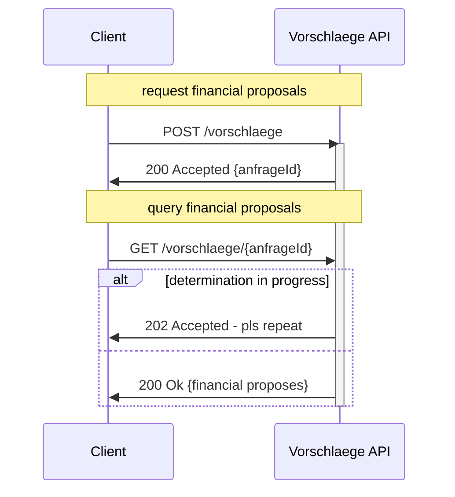

# Vorschlaege-API

As consumer, I want to determine appropriate financing proposals based on my situation and preferences. Analyze my needs and compare and find the best offers which fits my needs.


[](https://github.com/europace/authorization-api)
[](https://github.com/europace/baufi-passende-vorschlaege-api/releases)
[](https://martinfowler.com/bliki/TolerantReader.html)

## Documentation
[](https://europace.github.io/baufi-passende-vorschlaege-api/docs/swaggerui.html)
[](https://github.com/europace/baufi-passende-vorschlaege-api/blob/main/api/baufi-passende-vorschlaege-api.yaml)

## Usecases

- determine appropriate financing proposals on the base of the consumer needs
- get lead rating information (rate of success, effort and feasability)
- bookmark up to 10 financal proposals for further advice
## Requirements
- authenticated as advisor
- privacy statement acknowledged ([How to get](https://docs.api.europace.de/common/privacystatement/)) 

## Quick Start
To test our APIs and your use cases as quickly as possible, we have created a [Postman Collection](https://github.com/europace/baufi-passende-vorschlaege-api/tree/main/docs) for you.

### Authentication
Please use [](https://docs.api.europace.de/common/authentifizierung/authorization-api/) to get access to the APIs. The OAuth2 client requires the following scopes:

| Scope                                | API Usecase                                 |
| -------------------------------------- | --------------------------------------------- |
| `baufinanzierung:angebote:ermitteln` | to determine financial proposes |
| `baufinanzierung:vorgaenge:schreiben` | to create case and bookmark and/or accept offer |

## Find financial proposals

As consumer, I can find financial proposals to compare and pick suitable solutions for my mortage.

The experience of determining appropriate financing proposals is one of the deciding factors for the success of the lead. In order for the user to get a quick feedback, the determination is offered asynchronously.


### Request financial proposals

To find the right financial proposals we need some data. There are no mandatory-fields, but the more data we get, the more accurate the results will be. If you do not have explicit data in a field, please send "null", so we recognize that there is no known data to this specific field and our systems can work on that correctly. Please note [using without privacy statement](#usage-without-privacy-statement).

We recommend the following fields for buying or build with Bauträger to get relevant financial proposals:
- einkommenNetto
- geburtsdatum
- eigenKapital
- objektArt
- plz

We recommend the following fields to get relevant LeadRating results:
- beschaeftigtSeit
- arbeitBefristet
- beschaeftigungsArt
- sonstigeEinnahmen
- nichtAbgeloesteRatenkrediteRestschuld
- vermietet
- baujahr
- gewerblicheNutzung
- wohnflaeche

To adjust the financial solution, you can define preferences in `praeferenzen`.

example request:
``` http
POST /v1/vorschlaege/ HTTP/1.1
Host: baufinanzierung.api.europace.de
Content-Type: application/json
Authorization: Bearer [access_token]
Content-Length: 1332

{
    "metadaten": {
        "datenkontext": "TEST_MODUS",
        "extKundenId": "",
        "extClientId": "",
        "gewuenschteAnzahlVorschlaege": 2
    },
    "kundenangaben": {
        "haushalte": [
            {
                "kunden": [
                    {
                        "beschaeftigtSeit": "2010-01-26",
                        "arbeitBefristet": false,
                        "einkommenNetto": 5000,
                        "geburtsdatum": "1999-05-26",
                        "beschaeftigungsArt": "ANGESTELLTER"
                    }
                ],
                "finanzielleSituation": {
                    "eigenKapital": 100000,
                    "sonstigeEinnahmen": 0,
                    "nichtAbgeloestePrivateDarlehenRestschuld": 0,
                    "nichtAbgeloesteRatenkrediteRestschuld": 0
                }
            }
        ],
        "finanzierungsbedarf": {
            "finanzierungszweck": "KAUF",
            "grundstueckKaufpreis": 380000,
            "kaufpreis": 250000,
            "modernisierungsKostenInklEigenleistungen": 25000,
            "modernisierungEigenleistung": 15000,
            "praeferenzen": {
                "rate": 900,
                "faelligkeitsdatum": "2023-01-04T06:54:56.747Z",
                "kreditEntscheidungsZeit": "2022-11-01T06:54:56.747Z",
                "laufzeit": 60
            }
        },
        "finanzierungsobjekt": {
            "objektArt": "EINFAMILIENHAUS",
            "vermietet": false,
            "baujahr": 2000,
            "gewerblicheNutzung": false,
            "anschrift": {
                "plz": "10179",
                "ort": "Berlin",
                "strasse": "Klosterstrasse",
                "hausnummer": "8"
            },
            "wohnflaeche": 150
        }
    }
}
```

example response:
``` json
{
    "anfrageId": "passende-vorschlaege-71e2faa9-4094-4f66-8909-02677e5e9d7f"
}
```

### Query financial proposals

The `anfrageId` can be used to retrieve the appropriate financing proposals.

example request:
``` http
GET /v1/vorschlaege/{anfrageId} HTTP/1.1
Host: baufinanzierung.api.europace.de
Content-Type: application/json
Authorization: Bearer [access_token]
```

example response:

If finding appropriate financing proposals is already in progress, please try again until code 200.

``` http
202 - Accepted
```

If determination is finished, the financing proposals will be delivered:
``` http
200 - OK
```
``` json
{
    "vorschlaege": [
        {
            "finanzierungsVorschlagId": "6c8f8357b6ace5c6bce4047524fb3348",
            "annahmeFrist": "2022-10-06",
            "finanzierungsbausteine": [
                {
                    "@type": "ANNUITAETENDARLEHEN",
                    "restschuldNachZinsbindungsEnde": 113128.34,
                    "schlussrate": 667.66,
                    "datumLetzteRate": "2057-05-31",
                    "anzahlRaten": 426,
                    "tilgungssatzInProzent": 1.25,
                    "darlehensbetrag": 189000.0,
                    "annuitaetendetails": {
                        "zinsbindungInJahren": 20,
                        "tilgung": {
                            "@type": "RATE",
                            "rate": 888.3,
                            "tilgungsbeginn": "2023-02-27"
                        },
                        "sondertilgungJaehrlich": 5.0
                    },
                    "bereitstellungszinsfreieZeitInMonaten": 6,
                    "sollZins": 4.39,
                    "effektivZins": 4.5,
                    "rateMonatlich": 888.3,
                    "produktAnbieter": "Musterbank"
                }
            ],
            "darlehensSumme": 189000.00,
            "sollZins": 4.390,
            "effektivZins": 4.500,
            "machbarkeit": 0,
            "rank": 0,
            "gesamtRateProMonat": 888.3,
            "zinsbindungInJahrenMinMax": "20"
        },
        {
            "finanzierungsVorschlagId": "20bbd098eeb050dd44e28b6c088e3f1f",
            "annahmeFrist": "2022-10-06",
            "finanzierungsbausteine": [
                {
                    "@type": "ANNUITAETENDARLEHEN",
                    "restschuldNachZinsbindungsEnde": 98983.13,
                    "schlussrate": 558.94,
                    "datumLetzteRate": "2054-07-31",
                    "anzahlRaten": 392,
                    "tilgungssatzInProzent": 1.5,
                    "darlehensbetrag": 189000.0,
                    "annuitaetendetails": {
                        "zinsbindungInJahren": 20,
                        "tilgung": {
                            "@type": "RATE",
                            "rate": 911.93,
                            "tilgungsbeginn": "2023-02-27"
                        },
                        "sondertilgungJaehrlich": 5.0
                    },
                    "bereitstellungszinsfreieZeitInMonaten": 6,
                    "sollZins": 4.29,
                    "effektivZins": 4.4,
                    "rateMonatlich": 911.93,
                    "produktAnbieter": "Musterbank"
                }
            ],
            "darlehensSumme": 189000.00,
            "sollZins": 4.290,
            "effektivZins": 4.400,
            "kennung": "Superzins",
            "machbarkeit": 0,
            "rank": 1,
            "gesamtRateProMonat": 911.93,
            "zinsbindungInJahrenMinMax": "20"
        }
    ],
    "nebenkosten": {
        "maklergebuehr": 9639.00,
        "notargebuehr": 5400.00,
        "grunderwerbsteuer": 9450.00
    },
    "leadRating": {
        "successRating": "D",
        "effortRating": {
            "rating": false,
            "explanations": []
        },
        "feasibilityRating": 0
    }
}
```

When finding the appropriate proposals, we attach importance to being able to deliver quickly. It can therefore happen that the lead rating is not returned directly with the matching proposal and is therefore not included in the response. A lead rating is always determined for each matching proposal. It can therefore, can be retrieved with a further request if necessary.

## Bookmark financial proposals

### Create bookmark

As consumer, I can bookmark suitable financial proposals to review them later or discuss them with the advisor.

With `beschreibung`, a description or heading can be given to the proposal, which can be seen both when reviewing the proposal via `/list` or in a later discussion with an advisor.

You can bookmark up to 10 financial proposals to review them later and/or discuss them with the advisor directly or later. Financial proposals are always a part of a case in Europace, where they stored. If you want to bookmark them, please create a case with [Kundenangaben-API](https://docs.api.europace.de/baufinanzierung/vorgaenge/kundenangaben-api/) ([test-enviroment](https://docs.api.europace.de/common/various-rest/test-enviroment/)) before, and note the acknowledgement of the [privacy statement](https://docs.api.europace.de/common/privacystatement/). After that, you can bookmark a financial propose into the case.

example request:

```http
POST /vorschlag/bookmark HTTP/1.1
Host: baufinanzierung.api.europace.de
Content-Type: application/json
Authorization: Bearer [access_token]

    {
      "anfrageId": "passende-vorschlaege-c5486371-3d1e-43e2-8fc4-db920bde4fef",
      "finanzierungsVorschlagId": "d550a975da78f73d9e3256352ce0f366",
      "vorgangId": "ABC123",
      "beschreibung": "Beschreibungstext für diesen Vorschlag."
    }
```

Response:

```http
200 - OK
```

```json
{
  "message": "Vorschlag abgelegt."
}
```

### List bookmarks

As consumer, I get all bookmarked financial proposals to get an overview of my suitable solutions.

example request:
```http
GET /vorschlaege/list/ABC123 HTTP/1.1
Host: baufinanzierung.api.europace.de
Content-Type: application/json
Authorization: Bearer [access_token]

```

example response with 3 bookmarks:
```http
200 - OK
```

```json
{
  "vorschlaege": [
    {
      "finanzierungsVorschlagId": "72027af9f2890bad4506998f37fa7b49",
      "annahmeFrist": "2022-07-13",
      "finanzierungsbausteine": [
        {
          "@type": "ANNUITAETENDARLEHEN",
          "restschuldNachZinsbindungsEnde": 113938.09,
          "schlussrate": 366.82,
          "datumLetzteRate": "2050-12-31",
          "anzahlRaten": 352,
          "tilgungssatzInProzent": 2.03,
          "darlehensbetrag": 189000.0,
          "annuitaetendetails": {
            "zinsbindungInJahren": 15,
            "tilgung": {
              "@type": "RATE",
              "rate": 900.9,
              "tilgungsbeginn": "2022-11-30"
            },
            "sondertilgungJaehrlich": 5.0,
            "auszahlungszeitpunkt": "2022-10-30"
          },
          "bereitstellungszinsfreieZeitInMonaten": 12,
          "sollZins": 3.69,
          "effektivZins": 3.78,
          "rateMonatlich": 900.9,
          "produktAnbieter": "Musterbank"
        }
      ],
      "darlehensSumme": 189000.00,
      "sollZins": 3.690,
      "effektivZins": 3.780,
      "gesamtRateProMonat": 900.9,
      "zinsbindungInJahrenMinMax": "15",
      "beschreibung": "Beim Bookmarken angegebener Beschreibungstext für diesen Vorschlag."
    },
    {
      "finanzierungsVorschlagId": "c2d526946ad73efcf27385a363bdbafc",
      "annahmeFrist": "2022-07-05",
      "finanzierungsbausteine": [
        {
          "@type": "ANNUITAETENDARLEHEN",
          "restschuldNachZinsbindungsEnde": 211525.79,
          "schlussrate": 1022.09,
          "datumLetzteRate": "2060-05-31",
          "anzahlRaten": 465,
          "tilgungssatzInProzent": 1.0,
          "darlehensbetrag": 270000.0,
          "annuitaetendetails": {
            "zinsbindungInJahren": 15,
            "tilgung": {
              "@type": "RATE",
              "rate": 1253.25,
              "tilgungsbeginn": "2022-11-30"
            },
            "sondertilgungJaehrlich": 5.0
          },
          "bereitstellungszinsfreieZeitInMonaten": 6,
          "sollZins": 4.57,
          "effektivZins": 4.69,
          "rateMonatlich": 1253.25,
          "produktAnbieter": "Musterbank 2"
        }
      ],
      "darlehensSumme": 270000.00,
      "sollZins": 4.570,
      "effektivZins": 4.690,
      "gesamtRateProMonat": 1253.25,
      "zinsbindungInJahrenMinMax": "15"
    },
    {
      "finanzierungsVorschlagId": "feac4e6004939e52dd925d8414ec0a9",
      "annahmeFrist": "2022-01-26",
      "finanzierungsbausteine": [
        {
          "@type": "ANNUITAETENDARLEHEN",
          "restschuldNachZinsbindungsEnde": 104065.92,
          "schlussrate": 463.13,
          "datumLetzteRate": "2053-08-31",
          "anzahlRaten": 392,
          "tilgungssatzInProzent": 2.5,
          "darlehensbetrag": 179000.0,
          "annuitaetendetails": {
            "zinsbindungInJahren": 15,
            "tilgung": {
              "@type": "TILGUNG_IN_PROZENT",
              "tilgungssatzInProzent": 2.5,
              "tilgungsbeginn": "2022-02-28"
            },
            "sondertilgungJaehrlich": 5.0,
            "auszahlungszeitpunkt": "2022-02-27"
          },
          "bereitstellungszinsfreieZeitInMonaten": 3,
          "sollZins": 1.45,
          "effektivZins": 1.48,
          "rateMonatlich": 589.21,
          "produktAnbieter": "Musterbank 3"
        }
      ],
      "darlehensSumme": 179000.00,
      "sollZins": 1.450,
      "effektivZins": 1.480,
      "kennung": "Regional",
      "gesamtRateProMonat": 589.21,
      "zinsbindungInJahrenMinMax": "15"
    }
  ]
}
```

### Delete bookmark
As consumer, I delete bookmarked financial proposals to disqualify them and get a better overview. 

example request:
```http
POST /vorschlag/delete HTTP/1.1
Host: baufinanzierung.api.europace.de
Content-Type: application/json
Authorization: Bearer [access_token]

    {
      "finanzierungsVorschlagId": "d550a975da78f73d9e3256352ce0f366",
      "vorgangId": "ABC123"
    }
```

example response:
```http
200 - OK
```
```json
{
  "message": "Vorschlag d550a975da78f73d9e3256352ce0f366 erfolgreich gelöscht."
}
```

## Usage without privacy statement
In the sales journey it can be a problem to hit the consumer to early with privacy statements.
With the Vorschlaege-API it is possible to find appropriate financial proposals without personell information but the same results. 
The solution is to pseudonominate the input values in a following way:

- Date of birth as any day in the year (ex.: 1991-01-01)
- Nettoeinkommen rounded to 100€
- BeschäftigtSeit at least rounded to month (the longer in the past, the less accurate the value can be)
- Eigenkapital round to 1000€, for values from 1 Mio also to 10.000€.
- Kredit-Restschuld round to 1000€
- sontige Einnahmen round to 100€
- Detailed address data for the property are not required for the calculation, only the zip code or alternatively the selection of a federal state is required to calculate realistic ancillary costs and to enable regional offers.
- Technical parameters of the object (living space, year of construction) can be rounded, but are not relevant for the consumer's personal relationship, because at the time of the request there is no relationship between the consumer and the object.

## Support
If you have any questions or problems, please contact helpdesk@europace2.de.

## Terms of use
The APIs are provided under the following [Terms of Use](https://docs.api.europace.de/terms/).

