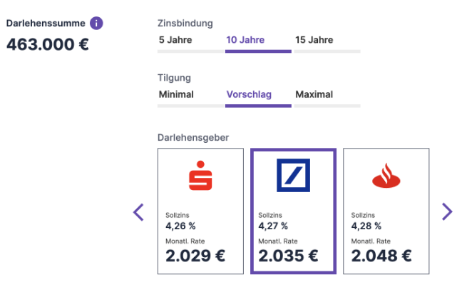

# Vorschläge-API ermittelt unterschiedliche Optionen

Die Vorschläge-API ist in der Lage ein breites Spektrum an an Finanzierungsvorschlägen gleichzeitig zu generieren und zweidimensional sortiert zurückzugeben. Dabei kann sich sowohl die Zinsbindung als auch die Tilgung unterscheiden.

Zur Aktivierung der Optionsermittlung ist in den Metadaten der dafür notwendige Modus "exploration-matrix" zu aktivieren:
```
{
    "metadaten": {
        "datenkontext": "TEST_MODUS",
        "mode": "exploration-matrix"
    }
}
```

## Anfrage

Die Anfrage muss neben dem Mode keine weiteren besonderen Bedingungen erfüllen. Durch Vorgabe der Präferenzen "zinsbindungInJahren" oder "tilgung" kann der Rahmen der Optionsermittlung vorgegeben werden. Eine Präferenz Zinsbindung von 10 Jahren erzeugt Optionen von 5, 10 und 15 Jahren Zinsbindung. Wird eine Zinsbindung größer 15 Jahre vorgegeben, z.B. 20 Jahre, werden Optionen zu 10, 15 und 20 Jahre erzeugt. 
Eine Vorgabe von Tilgungssätzen für die Optionsermittlung ist nicht empfehlenswert, da hier standardmäßig die minimal möglichen Tilgungen (gewöhnlich 1%) als untere Grenze und eine 1/3 des verfügbaren Haushaltsnettoeinkommen entsprechende Rate als obere Grenze verwendet wird. Eine Tilgungsvorgabe muss sich dann innerhalb dieses Rahmens bewegen. Bei entsprechend hohem Einkommen oder Anschlussfinanzierungen (Prolongationen) werden automatisch Volltilger-Optionen als Maximal-Tilgungs-Vorschlag generiert.

## Antwort

Im Modus "exploration-matrix" wird immer versucht, 3 x 9 Vorschläge zu generieren und in einer 3x3x3 Matrix anzuordnen. Die Position in der Ergebnis-Matrix wird über das Feld "vorschlagsOption" definiert, die Position innerhalb der einer vorschlagsOption definiert der Rank (aufsteigend nach Machbarkeit, Sollzins und Rate):

| Tilg/ZiBi             | Tilg niedrig          | Tilg mittel           | Tilg hoch |
| --------------------- | --------------------- | --------------------- | --------------------- |
|**ZiBi kurz**| "kurz-niedrig" | "kurz-mittel" | "kurz-hoch" |
|**ZiBi mittel**|"mittel-niedrig"|"mittel-mittel"|"mittel-hoch"|
|**ZiBi lang**|"lang-niedrig"|"lang-mittel"|"lang-hoch"|


## Ranking
Für jede der 9 Positionen oben werden 3 Vorschläge gerechnet. Das Frontend kann dann entscheiden ob es nur Rank 0 darstellt oder alle 3 Ergebnisse je Rank.



Sollten auf Grund von Showstopper-Beschränkungen in keiner der ProductEngines für bestimmte Positionen Vorschläge generierbar sein (z.B. weil die entsprechende Zinsbindung nicht angeboten wird), bleibt die zugehörige Position leer.


## Grenzfälle

Es besteht die Möglichkeit, dass die einzig machbaren Tilgungssätze genau der Mindesttilgung entsprechen (z.B. bei hohen Beleihungsausläufen). Dann unterscheiden sich die Tilgungen/Raten für die jeweilige Zinsbindung nicht oder nur minimal. Weiterhin besteht aktuell die Möglichkeit, dass Vorschläge aus dem mittleren Tilgungsbereich eine höhere Rate/Tilgung aufweisen als die Vorschläge mit Maximal-Tilgung. Hier finden fortlaufend Optimierungen statt.

