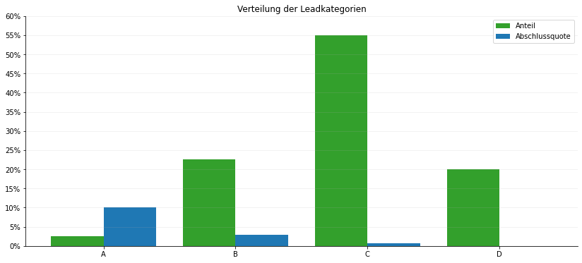

# Begriffe Rating, Scoring, Rank und Machbarkeit / feasibility in der #passt Vorschläge-API

## Rating

- Lead Rating: Oberbegriff und Knoten für alle Rating-Konzepte der Vorschläge-API, das Lead Rating bezieht sich immer auf die gesamte Verbraucher-Situation bzw. alle Vorschläge der Ergebnisliste

- successRating (A-D): Klassifizierung der Lead-Qualität nach Abschlusswahrscheinlichkeit (beide unterschreiben). Die Ratingklassen repräsentieren eine statistische Verteilung der Vorgänge. Die Gruppe der A-Leads hat dabei eine ca. 4x so hohe Wahrscheinlichkeit für einen Vertragsabschluss als die Gruppe der C-Leads. Für die Klassifizierung wird ein Machine Learning Modell eingesetzt, das alle Eingabewerte des Vorgangs berücksichtigt. Dabei ergeben mehr Eingabedaten gewöhnlich ein etwas besseres Rating solange die Werte der eingegebenen Daten gleich sind. Die Eingabewerte haben unterschiedlich starken Einfluss im Rating Modell und sehr selten auftretende Konstellationen lassen sich nur mit einer größeren Unsicherheit in der Vorhersage bestimmen.

  
- effortRating (true,false): Vorgang abzuschließen wird aufwändig, inkl. einer Beschreibung warum

- feasibilityRating (0-100): Anteil der machbaren Angebote in der Ergebnisliste, Ausdruck der Wahrscheinlichkeit, dass ein Antrag erstellt werden kann (unabhängig davon ob der Verbraucher wirklich abschließen will). Der Wert feasibilityRating entspricht einem Mittelwert über alle Machbarkeitsergebnisse die in der Market Engine berechnet werden. Das sind im default Mode gewöhnlich 30 Produktanbieter mit all ihren Alternativen die auch in BaufiSmart erzeugt werden. Im Mode _exploration-matrix_ [de_howto_matrix.md](de_howto_matrix.md) sind es 9x30 Angebote, allerdings mit weniger Optionen als im default Mode. Die Machbarkeit wird dabei nach folgenden Werten berechnet: rot = 0, gelb = 50, grün = 100. Eine Vorschlagsliste mit 2x grün, 1x gelb und 1x rot ergibt ein feasibilityRating von 62,5. Die unter _gewuenschteAnzahlVorschlaege_ anforderte Anzahl Vorschläge hat keine Einfluss auf das feasibilityRating.
- Interpretation des feasibilityRating: wir empfehlen folgende Klassifizierung: 0-29 es wird schwierig eine passende Finanzierung zu finden, 30-49 Gute Chancen auf eine passende Finanzierung (mind. 1/3 der Produktanbieter bieten machbare Vorschläge an), 50-100 Sehr gute Chancen auf eine passende Finanzierung (mind. die Hälfte aller Produktanbieter bieten machbare Vorschläge an). Je nach Produktanbieter-Portfolio bietet sich im Bereich grö0er 0 bis 10 eine weitere Rating Stufe an, so dass Ratings darunter explizit mit "keine Finanzierung möglich" bewertet werden.
  

## Scoring

- scoring: Sortierung der einzelnen Vorschläge nach 12 Scoring-Kriterien, die für die Nutzer nicht sichtbar sind, Ergebnis ist ein technischer Score-Wert zum Sortieren. Dieser Wert wird nicht explizit in der Antwort ausgegeben. 

- rank: sichtbares Ergebnis des Scorings für den Nutzer, niedrigster Score = rank 0, im Mode "exploration-matrix" werden immer nur das jeweils am besten gescorte Angebot für jede Matrixposition ausgeliefert (minimaler rank). Die Sortierung erfolgt nach Wert für den Verbraucher (ranking). Dabei relevant sind Zins, Machbarkeit, Rate, Sondertilgung, Bereitsstellungszinsfreie Zeit, Gesamtlaufzeit und Bearbeitungszeit.

- Machbarkeit: Ergebnis der Berechnungsregeln der Market Engine für jeden Finanzierungsvorschlag in numerischer Form (rot=0, gelb=50, grün=100)
  

## Machbarkeitsmodell

API Aufrufe von Partnern mit umfangreichen Geschäftsbeziehungen durchlaufen vor der Berechnung in der Market Engine einn Machine Learning Prozess zur Vorhersage der Machbarkeit der konfigurierten Geschäftspartner. Die dabei ermittelten Produktanbieter mit der höchsten Machbarkeits-Wahrscheinlichkeit werden dann in der Market Engine exakt berechnet. Da bei diesem Vorgehen neben dem Machbarkeitsergebnis der Market Engine (Regelwerk) auch eine Machbarkeitswahrscheinlichkeit aus der Vorhersage anfällt, werden wir perspektivisch beide Werte für das feasibilityRating heranziehen.
